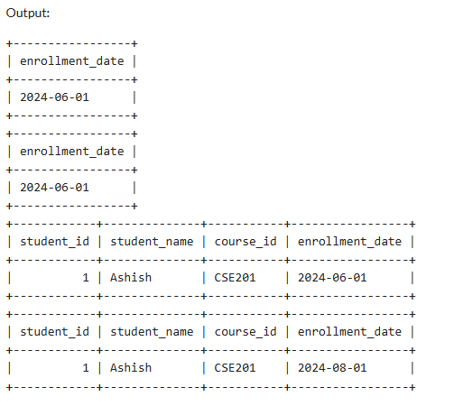
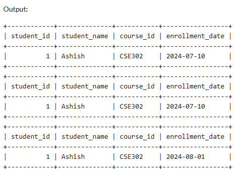

# Transactions_and-Concurrency-Control-SQL
SQL practice scripts demonstrating Transactions and Concurrency Control concepts: - Part A: Deadlock simulation using two concurrent sessions - Part B: MVCC (Multiversion Concurrency Control) for non-blocking reads/writes - Part C: Comparing Locking vs. MVCC under high concurrency

--

## 📊 Outputs

### 🔹 Session 1 Output

### 🔹 Session 2 Output

---

## ✅ Key Learnings

- Deadlocks can occur when transactions lock resources in different orders.  
- MVCC allows **non-blocking reads** while maintaining isolation.  
- Row-level locks ensure **strong consistency** but can block concurrent updates.  
- Correct use of **isolation levels** and **locking** ensures data integrity under concurrency.  
